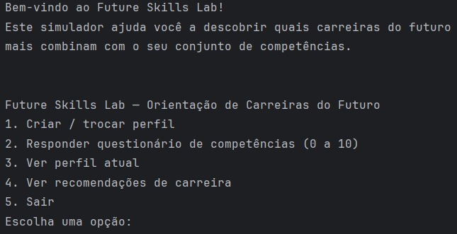
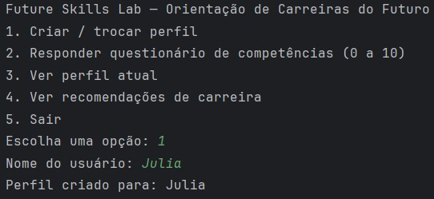
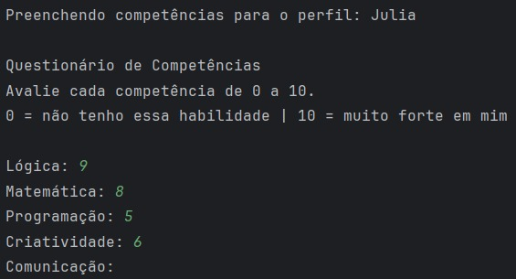
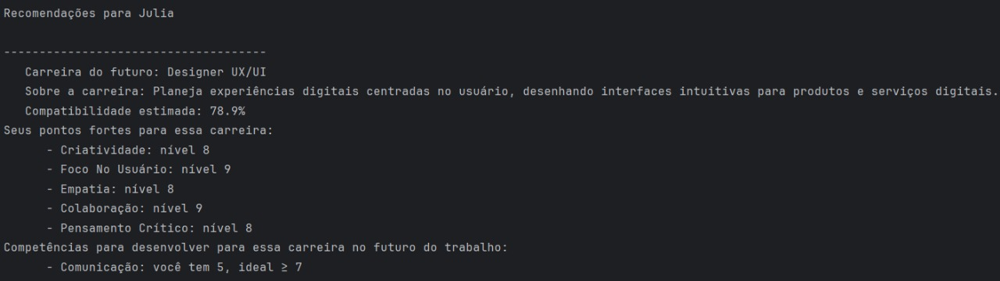

# Future Skills Lab — Orientação de Carreiras do Futuro

Projeto desenvolvido para a **Global Solution 2025.2** de **Pensamento Computacional e Automação com Python**.

O objetivo é simular uma ferramenta inteligente de **orientação de carreiras**, focada em
**profissionais do futuro**. A aplicação analisa um conjunto de competências técnicas e
comportamentais e estima a compatibilidade do usuário com diferentes carreiras emergentes.

---

## Propósito do Projeto

No contexto do **Future Skills Lab**, o sistema ajuda a responder:

> “Como minhas competências atuais se conectam com as profissões do futuro?”

A aplicação:

- coleta uma autoavaliação do usuário (0 a 10) em várias competências;
- compara o perfil com diferentes carreiras do futuro;
- calcula uma **porcentagem de compatibilidade** para cada carreira;
- mostra **pontos fortes** e **competências a desenvolver**.

---

## Tecnologias e Conceitos Utilizados

- Linguagem: **Python 3**
- Paradigma: **Programação Orientada a Objetos (POO)**
- Estruturas de dados: **listas, dicionários e tuplas**
- Organização em **módulos e classes**
- Interface textual simples (**CLI**)

Classes principais:

- `Competencia` — representa uma competência com nível de 0 a 10.
- `Perfil` — armazena o nome do usuário e suas competências.
- `Carreira` — descreve uma carreira do futuro e as competências mais importantes.
- `Recomendador` — calcula a compatibilidade entre o perfil e cada carreira.

---

## Estrutura de Arquivos

```
future-skills-lab/
│
├── main.py
├── models/
│   ├── competencia.py
│   ├── perfil.py
│   └── carreira.py
└── services/
    └── recomendador.py
```

### Descrição dos módulos:

- **main.py**  
  Controla o fluxo do programa e exibe o menu interativo (CLI).

- **models/**  
  Contém as classes de modelo:
  - `Competencia`
  - `Perfil`
  - `Carreira`

- **services/recomendador.py**  
  Contém o sistema de recomendação baseado em pesos e competências.

---

## Como Executar o Projeto

1. Certifique-se de ter o **Python 3.10+** instalado.
2. Clone o repositório:

```bash
git clone https://github.com/SEU-USUARIO/future-skills-lab.git
cd future-skills-lab
```

3. Execute o programa:

```bash
python main.py
```

4. Você verá o menu inicial:

```
1. Criar / trocar perfil  
2. Responder questionário de competências  
3. Ver perfil atual  
4. Ver recomendações  
5. Sair
```

---

## Fluxo de Uso

### **1. Criar Perfil**
Digite seu nome.

### **2. Responder o Questionário**
O sistema exibe todas as competências cadastradas.  
Você atribui notas de **0 a 10**.

### **3. Ver Perfil**
Mostra as competências avaliadas.

### **4. Receber Recomendações**
O sistema calcula:
- Compatibilidade (%)  
- Pontos fortes  
- Competências a desenvolver  
- Descrição das carreiras  

---

## Como Funciona o Sistema de Recomendação

Cada carreira tem um conjunto de competências com **pesos (importância)**:

```python
{
  "Programação": 9,
  "Lógica": 8,
  "Inovação": 7
}
```

O perfil do usuário vira um dicionário:

```python
{
  "Programação": 7,
  "Lógica": 5,
  "Criatividade": 8
}
```

O algoritmo:

1. Multiplica **peso × nível do usuário**  
2. Soma a pontuação total  
3. Normaliza para uma porcentagem (%)  
4. Separa:
   - **Forças** (nível ≥ 7)
   - **A desenvolver** (nível < 7)

---

## Demonstração

### **1️⃣ Menu Inicial**


### **2️⃣ Criação de Perfil**


### **3️⃣ Questionário de Competências**


### **4️⃣ Recomendações de Carreira**


> As imagens devem estar na pasta `/prints` do repositório.

---

## 🌍 Conexão com o Tema “Future Skills Lab”

Este projeto foi desenvolvido para refletir as habilidades essenciais no futuro do trabalho:

- pensamento crítico  
- criatividade  
- adaptabilidade  
- resolução de problemas  
- visão de negócios  
- domínio de tecnologias emergentes  

O simulador apoia o usuário a entender suas forças e possíveis caminhos profissionais.

---

## 👤 Autora

**Julia Antonia Claudia Cipriano Lopes – RM XXXXXXX**

---